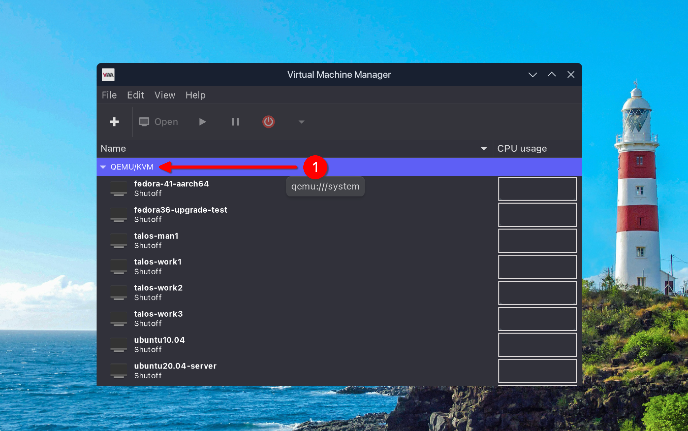
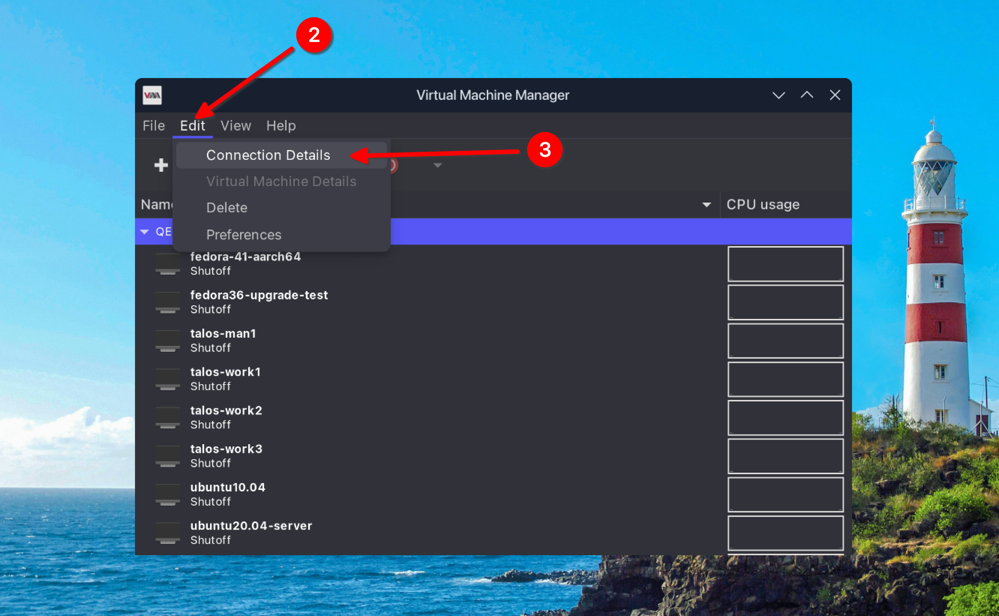
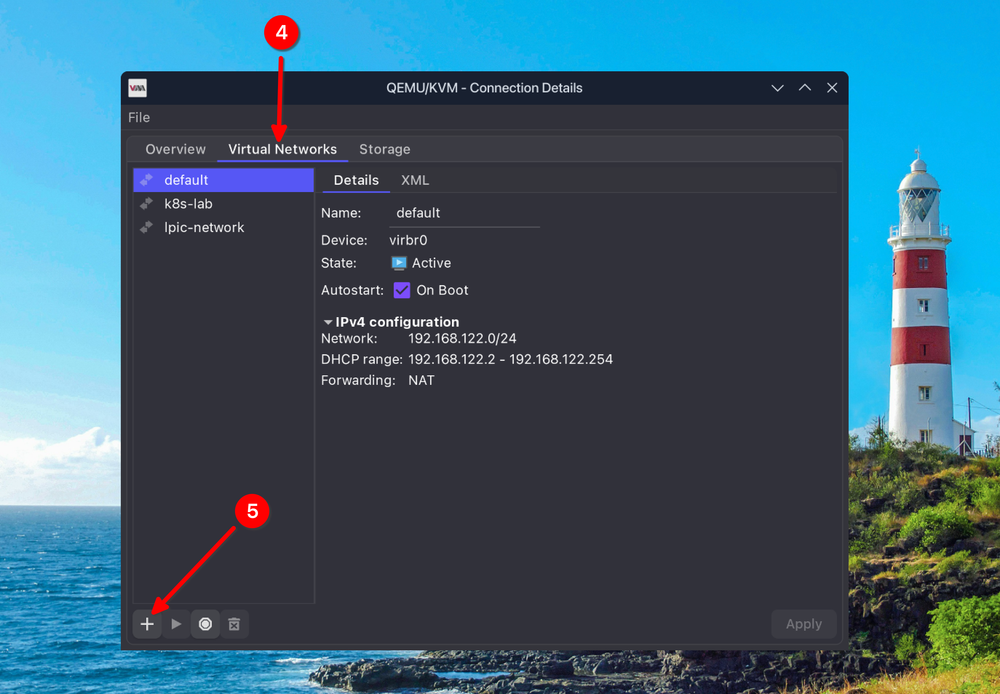
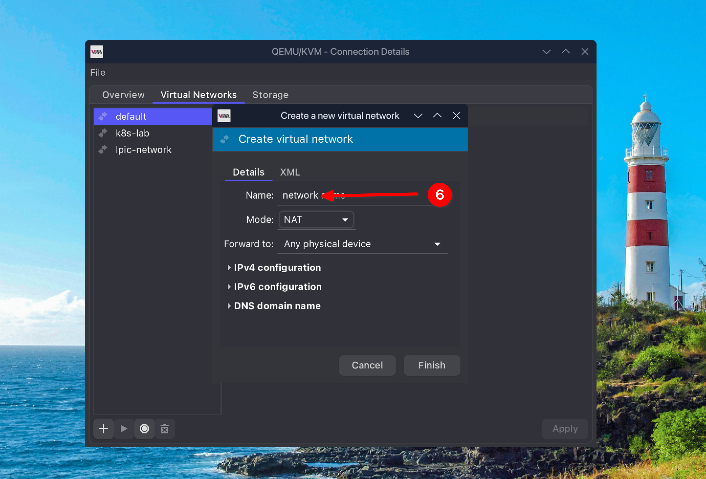
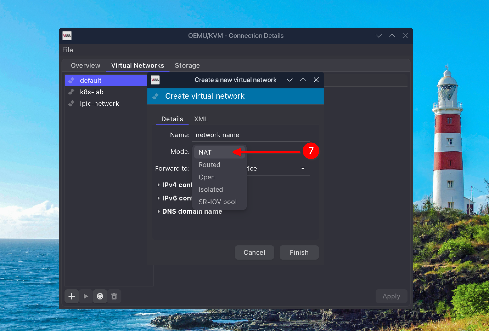

## Virtualization technologies

* What is virtualization?
* What are hypervisor softwares (VMWare, Virtualbox, Hyper-V, QEMU/KVM and etc.) ?
* What is difference between hypervisor types (type 1 and type 2) ?
* When we use hypervisor type 1 and when type 2?
* Free hypervisor softwares

### QEMU/KVM

* What is the type of QEMU/KVM hypervisor?
* QEMU/KVM GUI (virt-manager) and CLI (virsh, virt-install, virt-viewer)
* How to use QEMU/KVM from a remote machine?

#### How to install on Debian based machines

[tecmint](https://www.tecmint.com/install-qemu-kvm-ubuntu-create-virtual-machines/)  
[ubuntu](https://ubuntu.com/blog/kvm-hyphervisor)

#### How to install on Red Hat based machines

[Fedora docs](https://docs.fedoraproject.org/en-US/quick-docs/virtualization-getting-started/)

> This link also shows how to use CLI for managing virtual machines

### Add new virtual network

1. Select connection (in this case QEMU/KVM)

---

  

2. Then select Edit from tab bar  
3. Select Connection Details

---

4. Select Virtual Networks  
5. Then tap on (+) sign on the lower-left side of the window

> The default connection is "initial network", which is present by default and its DHCP is active.  
> You can see its interface as `virbr0` on the host.
>   

---

6. Select a valid name for the network (It must not be redundant or contain special characters)

---

7. Select NAT for Mode

> Read about Modes difference in Mode field (NAT, Routed, Open, Isolated and SR-IOV pool)  
> [Red Hat docs](https://docs.redhat.com/en/documentation/red_hat_enterprise_linux/7/html/virtualization_deployment_and_administration_guide/chap-virtual_networking)

---

8. Select IPv4 configuration  
9. Set subnet for network  
10. Uncheck **"Enable DHCPv4"** checkbox  
11. Finally tap on **"Finish"**
